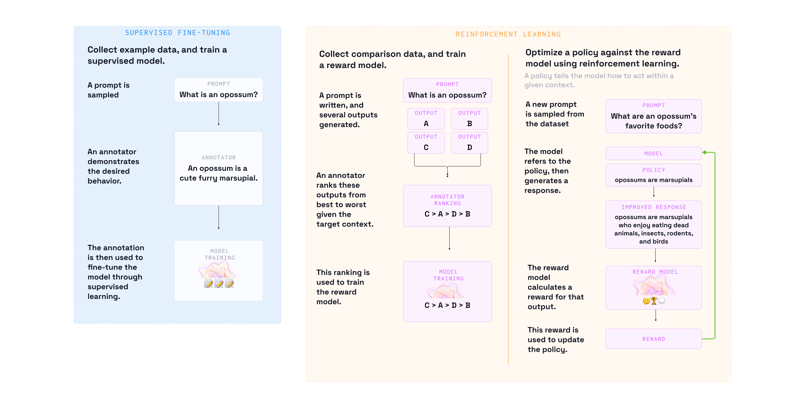

# Aligning ML Models with Human Feedback

- [What this repository contains:](#what-this-repository-contains)
  - [This repo may be of interest to you if:](#this-repo-may-be-of-interest-to-you-if)
  - [If you have any questions about this repo, or need a hand:](#if-you-have-any-questions-about-this-repo-or-need-a-hand)
- [Establishing Supervised Model Baseline](#establishing-supervised-model-baseline)
- [Gathering and Incorporating Human Feedback](#gathering-and-incorporating-human-feedback)
- [Training and Assessing the Final Model with Reinforcement Learning](#training-and-assessing-the-final-model-with-reinforcement-learning)

## What this repository contains:
This repository contains a collection of tutorials, best practices, and references for developers, data scientists, and machine learning professionals of all skill levels. 

### This repo may be of interest to you if: 
- You've attended the PyData Berlin Talk by [Nikolai Liubimov](https://www.linkedin.com/in/liubimov/) and [Erin Mikail Staples](https://www.linkedin.com/in/erinmikail/)
- You're interested in data-centric model development
- You're using [Label Studio](https://labelstud.io) to improve your ML process and models.

### If you have any questions about this repo, or need a hand:
- This repo is maintained by the [Label Studio](https://labelstud.io) team. 
- Reach out to the [Label Studio Community Team](mailto:community@labelstud.io) or open an issue with any questions.
- Join the [Label Studio Community Slack](https://slack.labelstud.io/?source=github-RLHF)
- Check out more resources around Human in the Loop / RHLF in our [Awesome List](https://github.com/heartexlabs/awesome-human-in-the-loop/tree/master)

## Establishing Supervised Model Baseline
In this step, we collect labeled text data to train an initial Large Language Model (LLM), focusing on task-specific performance improvements. This stage involves gathering instructions and responses to adapt the base model to a broad range of tasks, enhancing its ability to generate accurate and contextually relevant responses.
Typically this step involves:
- Selecting baseline Foundational Model (FM) that can perform fairly well on general tasks (like [GPT2](https://huggingface.co/gpt2) or [GPT-J](https://huggingface.co/EleutherAI/gpt-j-6b))
- Generate dataset of pairs prompt input followed by response. You can manually label dataset or generate the data like it is [provided in the example](https://github.com/tatsu-lab/stanford_alpaca)
- Peform supervised model finetuning.

## Gathering and Incorporating Human Feedback
This stage involves collecting comparison data to establish human preferences for the responses generated by the supervised model. By ranking multiple responses based on quality, we can train a reward model that effectively captures human preferences. This reward model plays a crucial role in reinforcement learning, optimizing the performance of the fine-tuned foundational model.

[Gathering Human Feedback Tutorial](tutorials/RLHF_with_Custom_Datasets.ipynb) - This Jupyter Notebook tutorial will guide you through the process of collecting comparison data, establishing human preferences, and incorporating this feedback into the reward model training.

## Training and Assessing the Final Model with Reinforcement Learning
The training stage is a challenging process, and the final model assessment is a critical component in evaluating your model's quality. It is essential to determine whether the model adheres to the provided instructions, avoids biases, and maintains a high standard of performance.
